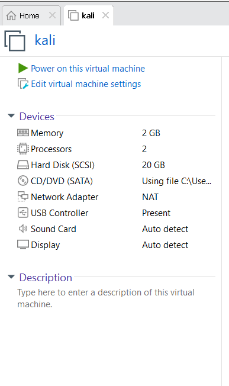
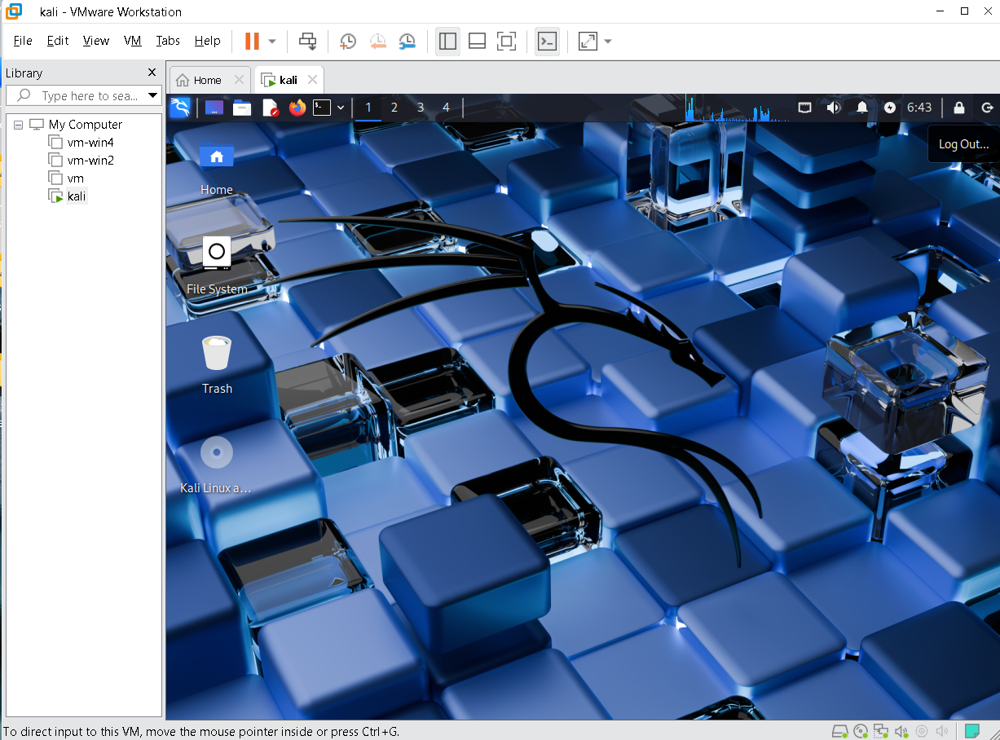
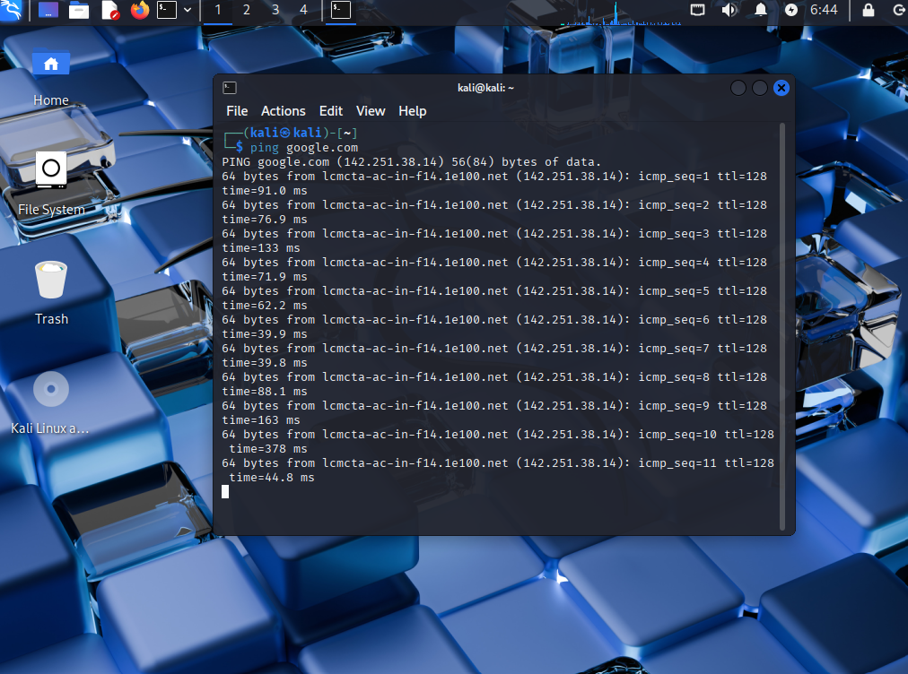

# 🔐 Kali Linux Cybersecurity Lab Setup

**Building an isolated virtual lab for cybersecurity and penetration-testing practice**


---

## 📌 Project Overview

This project documents the setup of a **Kali Linux virtual machine** using VMware Workstation. The goal is to build a self-contained lab environment for practicing cybersecurity tools, network reconnaissance, and general penetration-testing exercises.

---

## 🎯 Objectives

- Install VMware Workstation as the hypervisor.
- Create and configure a Kali Linux virtual machine.
- Allocate appropriate resources (memory, processors, disk, network).
- Power on the VM and confirm it boots correctly.
- Verify network connectivity by pinging an external host.
- Document the full process with screenshots.

---

## ⚙️ Lab Configuration

| Component        | Configuration       |
|-------------------|----------------------|
| Hypervisor        | VMware Workstation  |
| Guest OS          | Kali Linux           |
| Memory            | 2 GB                |
| Processors        | 2                    |
| Hard Disk (SCSI)  | 20 GB                |
| CD/DVD (SATA)     | Kali Linux ISO       |
| Network Adapter   | NAT                  |
| USB Controller    | Present               |
| Sound Card        | Auto detect           |
| Display           | Auto detect            |

---

## 🪜 Lab Setup Procedure

### Step 1. Install VMware Workstation

VMware Workstation was installed on the host machine to act as the hypervisor for the lab.

### Step 2. Create the Kali Linux Virtual Machine

A new VM named **kali** was created and configured with the resources listed in the table above, using the official Kali Linux ISO for installation.



### Step 3. Power On and Complete Installation

The VM was powered on inside VMware Workstation and Kali Linux was installed/booted successfully.



### Step 4. Verify Network Connectivity

With the Network Adapter set to **NAT**, connectivity was tested from inside Kali by pinging Google:

```bash
ping google.com
```

The VM received replies confirming a working internet connection through the host.



---

## 🔎 Lab Verification

| Test                       | Command             | Expected Result         |
|-----------------------------|----------------------|---------------------------|
| Check VM boots              | Power on VM          | Kali desktop loads        |
| Test internet connectivity  | `ping google.com`    | Successful replies        |

---

## 🔗 Tools & Resources

- **VMware Workstation:** <https://www.vmware.com/products/workstation-pro.html>
- **Kali Linux:** <https://www.kali.org/get-kali/>

---

## 🔐 Ethical Use

This lab is intended strictly for educational and authorized testing purposes.

---

## 👤 Author

**Muhammad Bin Faisal**
BS Computer Science, Sir Syed University of Engineering & Technology, Karachi
